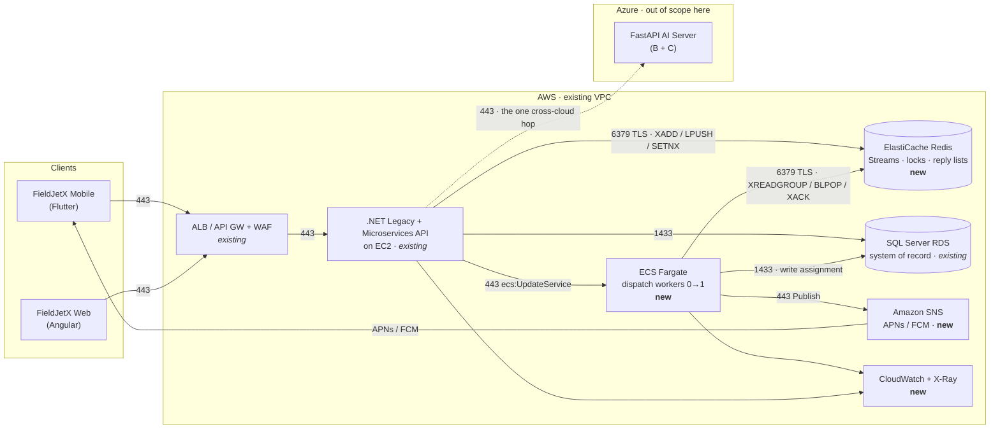

# 11 · How the services communicate

The map. Every hop in the new AWS tier — who calls whom, on what port, authenticated how, and who
initiates. Read this before debugging anything, and before opening any firewall rule.

Two rules that explain most of the design:

1. **The .NET API and the workers never call each other.** They coordinate entirely through Redis. That is
   why the workers have no inbound rules and no load balancer.
2. **Auto-Dispatch (A) never leaves AWS.** The only cross-cloud hop is the B/C AI request.

---

## Topology



`-.->` is the only line that crosses a cloud boundary. The worker has **no** arrow pointing into it.

---

## Hop table

| # | From | To | Port / protocol | Auth | Initiated by | New? |
|---|---|---|---|---|---|---|
| 1 | Mobile / Web app | ALB → .NET API | 443 HTTPS | user session + WAF | client | existing |
| 2 | .NET Microservices API | ElastiCache Redis | 6379 TLS | AUTH token (Secrets Manager) | .NET | **new** |
| 3 | .NET Microservices API | ECS control plane (`UpdateService`) | 443 HTTPS | EC2 instance role | .NET | **new** |
| 4 | ECS worker | ElastiCache Redis | 6379 TLS | AUTH token | worker | **new** |
| 5 | ECS worker | SQL Server (RDS) | 1433 TDS | SQL login (Secrets Manager) | worker | **new** |
| 6 | ECS worker | Amazon SNS `Publish` | 443 HTTPS | task-role IAM | worker | **new** |
| 7 | SNS | APNs / FCM → phone | AWS-managed | platform credential | SNS | **new** |
| 8 | Mobile app | .NET `POST /dispatches/{id}/respond` | 443 HTTPS | user session | technician | existing route, new payload |
| 9 | ECS worker + .NET | CloudWatch Logs / X-Ray | 443 HTTPS | IAM role | each service | **new** |
| 10 | ECS task-exec role | ECR + Secrets Manager | 443 HTTPS | exec-role IAM | ECS agent | **new** |
| 11 | .NET AI proxy | Azure FastAPI AI server | 443 HTTPS | API key / mTLS | .NET | **new** |
| 12 | .NET API | SQL Server | 1433 TDS | existing login | .NET | existing |

Security-group rules needed for exactly these (from `02`):

| Rule | On SG | Source | Port |
|---|---|---|---|
| hop 4 | `cp-$ENV-dispatch-redis` | `cp-$ENV-dispatch-workers` | 6379 |
| hop 2 | `cp-$ENV-dispatch-redis` | existing EC2 SG | 6379 |
| hop 5 | existing SQL SG | `cp-$ENV-dispatch-workers` | 1433 |
| hops 6, 9, 10, 11 | — | — | outbound 443, default egress |

Everything else needs no rule. The workers accept **zero** inbound connections.

---

## The dispatch loop, end to end

Per §5. Numbers reference the hop table.

```
1. Dispatcher enables Auto-Dispatch for a division  (web → .NET, hop 1)
     .NET calls ecs:UpdateService --desired-count 1                        (hop 3)
     Fargate task starts, joins the Redis consumer group                   (hop 4)

2. A job needs dispatching
     .NET XADDs the dispatch id onto dispatch:stream                        (hop 2)

3. Worker picks it up
     XREADGROUP after winning the per-division SETNX lock (TTL-bounded)     (hop 4)
     ranks technicians — distance/ETA · familiarity · time-until-free · priority
     (deterministic weighted sum · no LLM)

4. Offer the top-ranked technician
     worker → SNS Publish to that device endpoint                          (hop 6)
     SNS → APNs/FCM → phone                                                (hop 7)
     worker blocks on BLPOP for that technician's reply key                 (hop 4)

5. Technician taps Accept / Reject
     app POSTs /dispatches/{id}/respond                                     (hop 8)
     .NET de-dupes with SETNX resp:done, then LPUSHes the reply             (hop 2)
     the blocked BLPOP returns instantly — no polling                       (hop 4)

6. Close the loop
     Accept  → worker writes the assignment to SQL Server                   (hop 5)
               releases the division lock, XACKs the stream message         (hop 4)
     Reject / timeout → cascade to the next-ranked technician (back to 4)

7. Division toggled off
     .NET calls ecs:UpdateService --desired-count 0                         (hop 3)
     Fargate cost → $0. Redis keeps the queue.
```

**Why `BLPOP` and not polling:** the worker that sent the offer is already blocked on that exact key, so
an Accept wakes it in milliseconds. No poll interval to tune, no wasted Redis round-trips.

**Why the division lock:** two workers in the same consumer group must not dispatch the same division
concurrently. Redis Streams distributes entries; the `SETNX` lock serialises per division. The TTL means a
worker that dies mid-dispatch releases the division automatically.

**Why the message is `XACK`ed last:** an entry stays pending until the assignment is durably written, so a
worker crash leaves it claimable by another worker via `XCLAIM`. At-least-once, with the `resp:done`
de-dupe key making a redelivery harmless.

---

## The B / C path (for contrast)

```
Technician taps Summarise (B) or searches a part (C)
  → mobile → .NET AI-proxy route on EC2                    (hop 1)
  → .NET → Azure FastAPI AI server, job context in the payload   (hop 11 · cross-cloud)
  → AI server → on-prem LiteLLM → qwen3-vl-moe / bge-m3    (Azure-side, out of scope)
  → response back the same way; technician can always override
```

No Redis, no Fargate, no SNS. The AI server never touches SQL Server. If the seam is down, B and C fall
back to the manual path and **A is unaffected**.

---

## Failure behaviour per hop

| Hop fails | Effect | Recovery |
|---|---|---|
| 2 (.NET → Redis) | new dispatches can't be queued; queued ones keep processing | Multi-AZ failover, then retry with backoff |
| 4 (worker → Redis) | task exits; ECS restarts it; entries stay pending | `XCLAIM` on restart |
| 5 (worker → SQL) | assignment not written, message **not** `XACK`ed | redelivery after the pending timeout |
| 6/7 (SNS → phone) | technician never sees the offer | offer TTL expires → cascade to the next technician |
| 8 (reply → .NET) | `BLPOP` never returns | offer TTL → cascade |
| 11 (AWS → Azure) | B/C lose AI assist | manual fallback; **A unaffected** |

The offer TTL plus the cascade is the safety net for every push-path failure — not SNS retries.

**Next:** [`12-verify-and-teardown.md`](12-verify-and-teardown.md)
